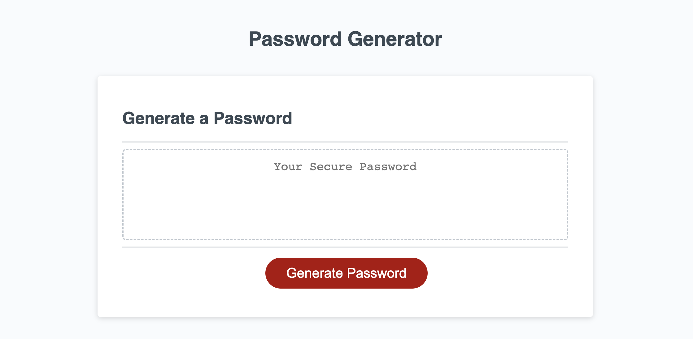

# Password Generator
<a href="#">View the Deployed Site</a>

 
 

| Technology Used         | Resource URL           | 
| ------------- |:-------------:| 
| JavaScript   | [https://developer.mozilla.org/en-US/docs/Web/JavaScript](https://developer.mozilla.org/en-US/docs/Web/JavaScript) | 
| HTML    | [https://developer.mozilla.org/en-US/docs/Web/HTML](https://developer.mozilla.org/en-US/docs/Web/HTML) | 
| CSS     | [https://developer.mozilla.org/en-US/docs/Web/CSS](https://developer.mozilla.org/en-US/docs/Web/CSS)      |   
| Git | [https://git-scm.com/](https://git-scm.com/)     |    

## Description
This application is useful for an employee to generate random password based on criteria they've selected. It runs in browser and features dynamically updated HTML and CSS powered by JavaScript codes. It has responsive user interface that ensures multiple screen size viewpoints. The password include special characters, see list in [OWASP Foundation.](https://owasp.org/www-community/password-special-characters)

## Acceptance Criterias
* When generate button is clicked then presented with a series of prompts for password criteria
* When prompted for password criterias then confirm criterias
* When prompted for the length of the password, choose a length of at least 8 characters and no more than 128 characters
* When asked for character types to include in the password, confirm whether or not to include lowercase, uppercase, numeric, and/or special characters
* When each prompt is answered, inputs should be validated and at least one character type should be selected
* When all prompts are answered, a password is generated that matches the selected criteria
* When the password is generated, the password is either displayed in an alert or written to the page

# Learning Points
* Learned to work with Javacript data structures, functions, arrays, operators,conditional loops like for, while, if statements and the use of some basic methods
* Tested how each of these topics work by printing out results via console.log
* Tried to write pseudocode to get an idea of how to structure code
* Learned new way of converting data -> spread operator (...) to turn any string into an array of single-characters
* Enhanced skill at Google-Fu -> learned to think about more specific prompting search in order to get better results

## Author Info
### Katherine Matovic
* [Portfolio](https://kfmatovic716.github.io/professional-portfolio/)
* [LinkedIn](https://www.linkedin.com/in/katherine-matovic-911666200/)
* [Github](https://github.com/kfmatovic716)
